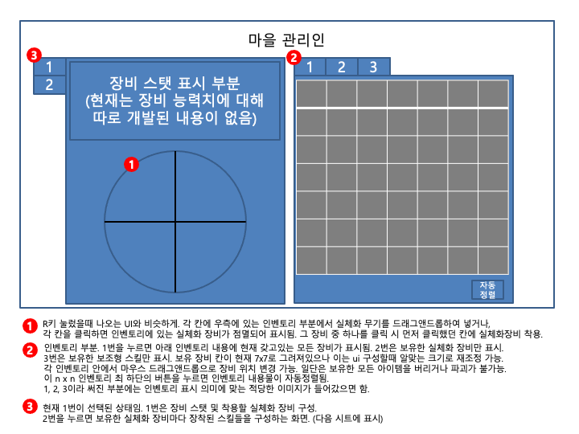
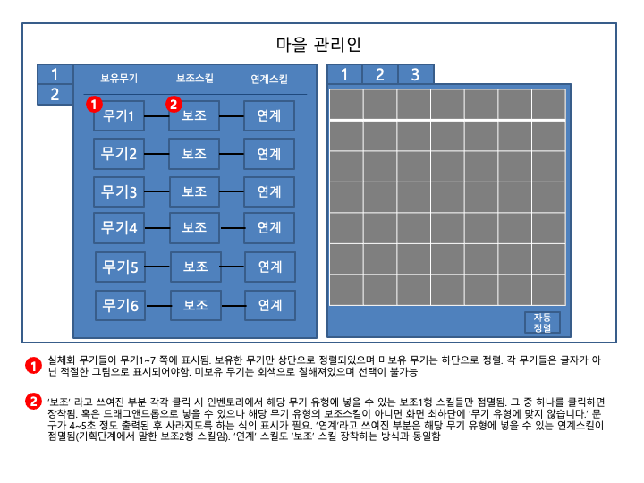
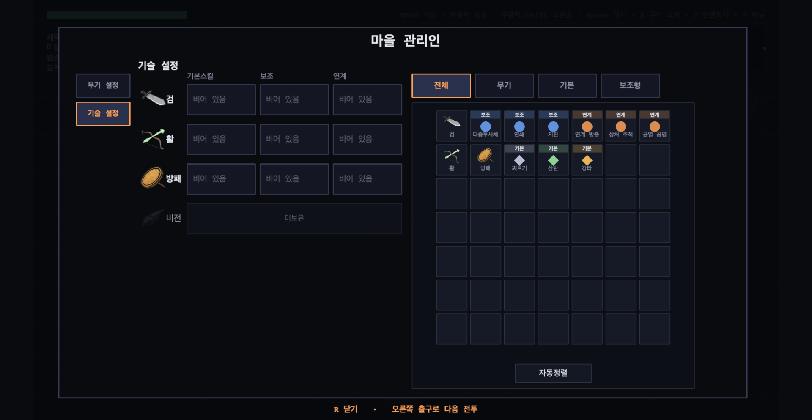

# 기획 도해와 구현 결과

기획 담당이 그린 UI 도해와 그것을 구현한 화면을 나란히 둔다.
**사람이 정하고 AI가 옮겼다**는 것을 글이 아니라 그림으로 보이기 위한 자료다.

| 파일 | 내용 |
| --- | --- |
| `ui-plan-1.png` | 기획 도해 — 장비 착용 탭과 인벤토리 |
| `ui-plan-2.png` | 기획 도해 — 무기별 스킬 탭 |
| `town-skill-tab.png` | 구현된 마을 장비 설정 화면 (`기술 설정` 탭) |

원본 파워포인트(`UI구성.pptx`)는 저장소에 넣지 않는다. 내용은 위 PNG에 그대로 있고,
저장소가 Public이라 기획 담당의 작업 파일 자체를 올릴 이유가 없다.

## 도해가 요구한 것

기획 도해는 마을 관리인 패널을 이렇게 그렸다.

- 좌측 세로 탭 2개
- 무기 행마다 `보유무기 ─ 기본스킬 ─ 보조 ─ 연계` 네 칸
- 우측 n×n 인벤토리 격자와 하단 자동정렬 버튼
- 인벤토리 필터 탭

## 구현 결과

행 구성과 칸 순서가 도해와 같다. 도해에 없던 것은 **왜 넣었는지**가 남아 있어야 한다.

| 도해에 없던 것 | 넣은 이유 |
| --- | --- |
| 항목 종류 배지(`기본` / `보조` / `연계`) | 점 색깔만으로는 어느 쪽이 연계인지 알 수 없어, 칸을 눌러 점멸시켜 보기 전에는 구분이 안 됐다 |
| 넣을 수 없는 칸을 흐리게 | 후보가 아닌 것을 눌러 헤매지 않도록. 배지·이름·아이콘까지 함께 흐려진다 |
| 올렸을 때 뜨는 설명 | 같은 보조형스킬도 무기마다 결과가 달라서, 설명문만으로는 무엇이 붙는지 알 수 없다 |
| 미보유 무기 행 | 도해는 6칸이 다 차 있지만 실제로는 순차 해금이라, 빈 줄 대신 `미보유`를 적었다 |

## 도해와 다르게 간 것

**무기 6종이 아니라 4종이다.** 조합 QA 표면적을 마감 안에 검증 가능한 크기로 줄인
결정이며 근거는 `docs/game-scope.md`에 있다. 행 구조 자체는 그대로다.
